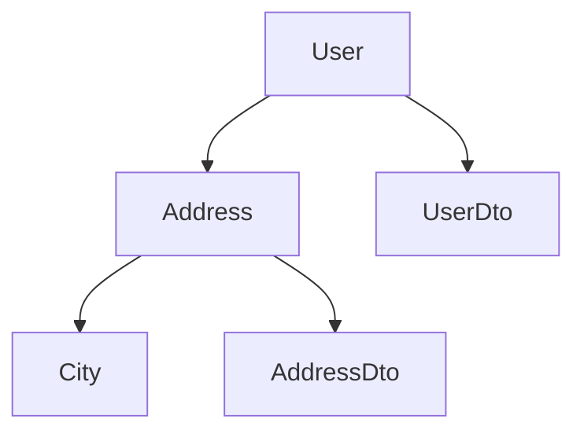

# Sprint 13 — CLI Tool

**Baseado em:** `Docs/Architecture/Estrutura-Soluction.md` (CLI seção), `Docs/Engines/10. BENCHMARK ENGINE.md`, `Docs/Engines/11. DOCUMENTATION GENERATOR.md`, `Docs/Spec/SPEC.md` (seção 11 — v2)

## Objetivo

Criar a CLI tool `dotnet flowmapper` com comandos para exportar grafo, executar benchmarks, analisar diagnósticos e gerar documentação automática.

---

## Tarefas

### 1. Projeto `FlowMapper.Cli`
- Console app com `System.CommandLine` (ou `dotnet tool`)
- Entry point: `Program.cs`

### 2. Comando `flowmapper graph`
```bash
dotnet flowmapper graph [--project <path>] [--output <path>] [--format mermaid|dot]
```
- Analisar projeto e extrair Flow Graph
- Exportar como diagrama Mermaid ou DOT
- Exemplo de saída:


### 3. Comando `flowmapper benchmark`
```bash
dotnet flowmapper benchmark [--output <path>]
```
- Executar Benchmark Suite (Sprint 12)
- Gerar relatório em Markdown/JSON

### 4. Comando `flowmapper diagnostics`
```bash
dotnet flowmapper diagnostics [--project <path>]
```
- Analisar projeto em busca de mapeamentos
- Reportar diagnósticos FM0001-FM0013
- Listar propriedades não mapeadas

### 5. Comando `flowmapper docs`
```bash
dotnet flowmapper docs [--project <path>] [--output <path>]
```
- Gerar documentação automática dos mappers
- README.md, mappers.md, profiles.md
- Baseado no `DocumentationGenerator` (Sprint 14)

### 6. Estrutura de Comandos
```
Commands/
├── GraphCommand.cs
├── BenchmarkCommand.cs
├── DiagnosticsCommand.cs
└── DocsCommand.cs
```

### 7. Parser de Projeto
```csharp
public static class ProjectAnalyzer
{
    public static Compilation GetCompilation(string projectPath);
    public static IEnumerable<MappingCandidate> FindMappers(Compilation compilation);
    public static FlowModel BuildFlowModel(Compilation compilation);
}
```

### 8. Output Formatters
- `IMermaidFormatter` — geração de diagramas Mermaid
- `IDotFormatter` — geração de DOT graphs
- `IMarkdownFormatter` — relatórios em Markdown
- `IJsonFormatter` — saída JSON para CI

### 9. Tool Manifest
- Configurar como `dotnet tool` para instalação global:
  ```bash
  dotnet tool install --global FlowMapper.Cli
  flowmapper graph --project ./MyApp.csproj
  ```

## Critérios de Aceitação

- [ ] `flowmapper graph` exporta diagrama Mermaid válido
- [ ] `flowmapper benchmark` executa e gera relatório
- [ ] `flowmapper diagnostics` lista problemas do projeto
- [ ] `flowmapper docs` gera documentação automática
- [ ] CLI instalável como dotnet tool global

## Referências

- `Docs/Architecture/Estrutura-Soluction.md` — seção CLI: commands, graph, export
- `Docs/Engines/11. DOCUMENTATION GENERATOR.md` — geração de docs
- `Docs/Engines/10. BENCHMARK ENGINE.md` — execução de benchmarks
- `Docs/Spec/SPEC.md` seção 11 — CLI tool (v2 future)

## Dependências

- Sprint 11 — teste suite (verificação dos comandos)
- Sprint 12 — benchmark engine
- Sprint 14 — documentation generator
